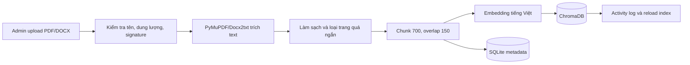
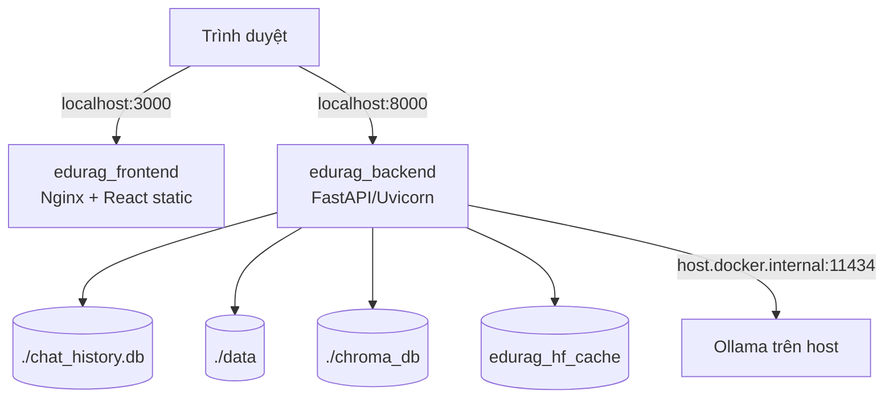

# EduRAG — Chatbot AI hỗ trợ tra cứu học vụ

## 1. Tổng quan dự án

EduRAG là hệ thống hỏi đáp học vụ dùng Retrieval-Augmented Generation (RAG), hướng đến việc hỗ trợ sinh viên tra cứu quy chế đào tạo, công tác sinh viên và tài liệu nghiệp vụ của Khoa. Giao diện được xây dựng bằng React + TypeScript; backend FastAPI quản lý tài khoản, tài liệu, lịch sử hội thoại và điều phối pipeline ChromaDB + Ollama.

Kiến trúc tổng quát hiện có:

```text
React Frontend (:3000) ← REST API → FastAPI Backend (:8000)
                                      ├── SQLite (tài khoản, metadata, chat, log)
                                      ├── data/ (PDF, DOCX)
                                      └── RAG → ChromaDB → Ollama (:11434 trên host)
```

### Mục tiêu

- Trả lời ngắn gọn dựa trên tài liệu đã nạp, không dùng kiến thức ngoài ngữ cảnh được truy hồi.
- Hiển thị nguồn bằng tên văn bản và trang để người dùng kiểm tra bản gốc.
- Cho phép quản trị viên quản lý tài liệu và trạng thái hiệu lực.
- Lưu lịch sử hội thoại riêng theo tài khoản và thu thập phản hồi Hữu ích/Chưa hữu ích.
- Có cấu hình Docker phục vụ chạy thử và làm nền cho triển khai chính thức.

### Đối tượng sử dụng

| Đối tượng | Vai trò trong mã nguồn | Nhu cầu sử dụng |
| --- | --- | --- |
| Sinh viên | `student` — đã có mã | Đăng ký, đăng nhập, chat, xem thư viện, xem nguồn và quản lý tài khoản. |
| Quản trị viên | `admin` — đã có mã | Quản lý tài liệu, metadata, chỉ mục và theo dõi dashboard. |
| GVCN/CVHT | Chưa có role riêng | Đối tượng định hướng có thể tra cứu học vụ; hiện phải dùng quyền `student` hoặc `admin` phù hợp. |
| Người vận hành | Không phải role ứng dụng | Quản lý Docker, Ollama, model, biến môi trường, backup và phục hồi. |

### Phạm vi và giới hạn đã xác định

- Hỗ trợ PDF và DOCX có văn bản trích xuất được.
- PDF scan/ảnh chưa có OCR; hệ thống từ chối nếu không lấy được text hợp lệ.
- Google Sign-In và gửi email đặt lại mật khẩu cần dịch vụ bên ngoài, nên hệ thống không hoàn toàn offline khi bật hai chức năng này hoặc khi model embedding chưa có trong cache.
- Chưa có bằng chứng benchmark chất lượng RAG, tải đồng thời, triển khai VPS/domain/HTTPS hoặc bộ kiểm thử tự động trong repository.

---

## 2. Trạng thái triển khai — cập nhật 10/09/2026

Trạng thái sử dụng: **Đã có mã**, **Đã kiểm thử**, **Chưa xác minh**, **Chưa triển khai** và **Đề xuất**. Có mã không đồng nghĩa đã kiểm thử.

| Hạng mục | Bằng chứng mã nguồn | Trạng thái | Hạn chế/công việc tiếp theo |
| --- | --- | --- | --- |
| Frontend và điều hướng | `frontend/src/App.tsx`, `MainLayout.tsx`, các page/component | Đã có mã | Cần kiểm thử responsive, accessibility và trạng thái lỗi. |
| Tài khoản và session | `Login.tsx`, `Settings.tsx`; `AuthSession`, các endpoint `/auth/*`, `/account/*` | Đã có mã | Google/SMTP phụ thuộc cấu hình; cần test TTL, thu hồi và nhiều thiết bị. |
| Lịch sử theo tài khoản | `ChatHistory.user_id/user_role`, các helper history/session | Đã có mã | Cần test chống truy cập chéo; quyền admin xóa lịch sử cần xác nhận. |
| Chat, feedback và nguồn | `/chat`, feedback; `RAGChain.achat`, `extract_sources`, `enrich_sources` | Đã có mã | Chưa có benchmark chất lượng, nguồn và độ trễ. |
| Thư viện và preview | `Library.tsx`, `DocumentCard/Row`, `PreviewDrawer` | Đã có mã | Lọc/phân trang ở client; cân nhắc server-side khi dữ liệu lớn. |
| Quản lý tài liệu | Các route trong `backend/admin.py` | Đã có mã | `GET /admin/documents` chưa yêu cầu auth; upload trùng filename trả 409 và chưa có chức năng thay nội dung. |
| PATCH metadata | `update_document` gọi `request.model_dump()` | Đã có mã | Chưa dùng `exclude_unset=True`; field bỏ qua được truyền thành `None`, làm ngữ nghĩa PATCH không rõ và hiện không thể chủ động xóa giá trị optional. |
| An toàn upload | `normalize_document_filename`, `get_safe_document_path`, `save_upload_file`, `validate_document_content` | Đã có mã | Cần test path traversal, file giả, dung lượng và DOCX bất thường. |
| Quản lý chunk nội bộ | `add_to_vector_store` dùng `ingestion_id` và rollback | Đã có mã | Chỉ quản lý phiên bản chunk trong lúc ghi/rebuild; không phải API thay thế nội dung tài liệu. |
| RAG đa lượt/phạm vi | `get_recent_chat_history`, `document_filename`, filter active | Đã có mã | Cần test câu tiếp nối, tài liệu được chọn và active/inactive/null. |
| Từ chối và trích nguồn | `MIN_RELEVANCE_SCORE`, `extract_sources` | Đã có mã | Ngưỡng 0,42 và heuristic nguồn chính chưa được hiệu chỉnh bằng benchmark. |
| Rebuild an toàn | staging collection, `.active_collection`, `_rebuild_lock` | Đã có mã | Cần test recovery và dọn collection staging cũ. |
| Dashboard | `ActivityLog`, stats/activities, `RecentActivities.tsx` | Đã có mã | Cần test số liệu, retention và quyền. |
| Docker | Compose, Dockerfile, Nginx | Đã có cấu hình | Chưa xác minh production, HTTPS, frontend healthcheck và restore. |
| OCR PDF scan | `load_and_chunk_document` chỉ trả thông báo OCR | Chưa triển khai | Đề xuất OCR có kiểm duyệt hoặc tiền xử lý. |
| Test tự động/CI | Không có `tests`, `*.test.*`, `*.spec.*` | Chưa triển khai | Đề xuất unit, integration, RAG evaluation và E2E. |

---

## 3. Phong cách thiết kế

Phong cách hiện tại được suy ra từ `frontend/src/index.css`, `MainLayout.tsx` và các component giao diện:

- **Màu chủ đạo:** xanh emerald/teal thể hiện giáo dục, tin cậy và trạng thái tích cực.
- **Thanh bên:** nền xanh navy đậm, chữ sáng, điểm nhấn emerald; cố định theo chiều cao màn hình.
- **Nội dung chính:** nền sáng, gradient xanh nhạt–kem, đường sóng trang trí nhẹ.
- **Thẻ và modal:** bo góc lớn, viền slate/emerald mảnh, bóng đổ mềm, một số lớp backdrop blur.
- **Typography:** sans-serif hệ thống; tiêu đề đậm, nhãn phụ viết hoa và tăng khoảng cách chữ.
- **Icon:** `@phosphor-icons/react`; dùng biểu tượng thống nhất cho chat, tài liệu, tài khoản và quản trị.
- **Phản hồi trạng thái:** skeleton loading, màu đỏ cho lỗi, xanh cho thành công, spinner/chấm động khi AI xử lý.
- **Responsive:** có breakpoint `sm`, `md`, `lg`; bố cục thẻ chuyển từ một cột sang hai/ba cột.
- **Khả năng truy cập:** đã có một số `aria-label`, label form và trạng thái disabled; chưa có báo cáo accessibility đầy đủ.
- **Theme:** chưa thấy hệ thống dark/light mode cho toàn ứng dụng; navy sidebar không đồng nghĩa đã có dark mode.

Frontend hiện dùng Tailwind CSS v4 và các component tự xây dựng, không có dependency shadcn/ui trong `frontend/package.json`.

---

## 4. Cấu trúc các trang

### 4.1 Đăng nhập và đăng ký (`/login`)

**Mục đích:** xác thực student/admin, tạo tài khoản sinh viên và khởi tạo quy trình quên mật khẩu.

**Thành phần:**

- Logo EduRAG và khối form trung tâm.
- Ba chế độ trong `Login.tsx`: đăng nhập, đăng ký và quên mật khẩu.
- Trường email/tên đăng nhập, mật khẩu, checkbox ghi nhớ đăng nhập.
- Đăng nhập Google được tải qua Google Identity Services khi provider được cấu hình.
- Validation bằng React Hook Form + Zod và thông báo lỗi/trạng thái.

**Hành động người dùng:**

- Student đăng nhập bằng email; admin đăng nhập bằng username.
- Chọn ghi nhớ đăng nhập, chuyển sang đăng ký hoặc yêu cầu liên kết reset.
- Đăng nhập Google nếu `GOOGLE_CLIENT_ID` khả dụng.

**Dữ liệu/API:** `POST /auth/login`; nếu thất bại frontend thử `POST /admin/login`; `POST /auth/register`; `GET /auth/providers`; `POST /auth/google`; `POST /auth/forgot-password`.

**Quyền truy cập:** công khai. Sau khi thành công, frontend lưu token ở `sessionStorage` hoặc `localStorage` và chuyển đến `/chat`.

**Lưu ý hiện trạng:** Google và SMTP cần cấu hình và test tích hợp trước khi vận hành.

### 4.2 Đặt lại mật khẩu (`/reset-password`)

**Mục đích:** cho phép student đặt mật khẩu mới từ token một lần gửi qua email.

**Thành phần:**

- Nhận `token` từ query string.
- Form mật khẩu mới và xác nhận mật khẩu, tối thiểu tám ký tự.
- Thông báo token thiếu, hết hạn hoặc không hợp lệ.
- Liên kết quay về đăng nhập.

**Hành động người dùng:** mở liên kết email, nhập mật khẩu mới và gửi form.

**Dữ liệu/API:** `POST /auth/reset-password`. `consume_password_reset_token` đánh dấu token đã dùng và thu hồi các session cũ của tài khoản.

**Quyền truy cập:** công khai nhưng phải có reset token hợp lệ; token có hiệu lực 30 phút theo mã nguồn.

### 4.3 Chat AI (`/chat`)

**Mục đích:** giao diện chính để hỏi đáp dựa trên kho tài liệu.

**Thành phần:**

- Hero giới thiệu và bốn câu hỏi nhanh khi chưa có tin nhắn.
- Danh sách tin nhắn user/assistant, trạng thái AI đang tìm kiếm.
- Ô nhập cố định phía dưới và nút gửi.
- Badge nguồn chính, danh sách nguồn liên quan và hành động xem nguồn.
- Nút Hữu ích/Chưa hữu ích cho câu trả lời có `message_id`.

**Hành động người dùng:** nhập hoặc chọn câu hỏi nhanh, gửi câu hỏi, xem nguồn, đánh giá câu trả lời, mở lại hội thoại cũ từ sidebar.

**Dữ liệu/API:** `POST /chat`, `POST /chat/{message_id}/feedback`, `GET /history/{session_id}`. Zustand `chatStore.ts` giữ `sessionId`, messages và loading.

**Quyền truy cập:** student và admin có session hợp lệ. Backend lưu chat theo `user_id` + `user_role`.

Chất lượng câu trả lời và nguồn phải được xác nhận bằng benchmark nghiệp vụ.

### 4.4 Thư viện tài liệu (`/library`)

**Mục đích:** giúp người dùng xem danh mục tài liệu, metadata và đặt câu hỏi giới hạn theo một văn bản.

**Thành phần:**

- Thanh tìm kiếm theo tên, mô tả, tóm tắt, danh mục và đơn vị ban hành.
- Bộ lọc PDF/DOCX/danh mục; sắp xếp mới/cũ, tên, dung lượng.
- Chuyển chế độ grid/list và phân trang bốn mục mỗi trang.
- Card/row hiển thị tên, loại, tóm tắt, đơn vị, năm, dung lượng, trạng thái.
- Preview drawer và modal “Hỏi AI” theo tài liệu.

**Hành động người dùng:** tìm/lọc/sắp xếp, xem trước PDF/DOCX, nhập câu hỏi gắn với tài liệu, chuyển đến chat.

**Dữ liệu/API:** `GET /admin/documents`, `GET /documents/{filename}/preview`, `POST /chat` với `document_filename`.

**Quyền truy cập:** route frontend yêu cầu token; preview backend yêu cầu student/admin. `GET /admin/documents` hiện không có dependency auth trong backend, nên chính sách công khai/đăng nhập cần xác nhận và kiểm thử.

**Lưu ý hiệu năng:** tìm/lọc/sắp xếp/phân trang hiện ở client sau khi tải toàn bộ tài liệu.

### 4.5 Quản trị (`/admin`)

**Mục đích:** quản lý tài liệu và theo dõi trạng thái sử dụng EduRAG.

**Thành phần:**

- Thẻ tổng tài liệu/chunk, tổng câu hỏi/phiên và tỷ lệ feedback tốt.
- Bảng tài liệu; modal upload/chỉnh metadata; xác nhận xóa.
- Biểu đồ phân bố danh mục và danh sách hoạt động gần đây.
- Metadata gồm tên hiển thị, danh mục, đơn vị ban hành, năm, tóm tắt và trạng thái.

**Hành động người dùng:** upload tài liệu, chỉnh metadata/status, xóa tài liệu, theo dõi thống kê và log hoạt động.

**Dữ liệu/API:** `GET /admin/documents`, stats/activities, upload, PATCH metadata và delete. Backend còn có batch upload và rebuild dù UI chưa thể hiện rõ hai hành động này.

**Quyền truy cập:** API thay đổi dữ liệu, stats và activities yêu cầu admin. Header/sidebar chỉ hiển thị link quản trị cho admin; tuy nhiên `App.tsx` mới kiểm tra có token, chưa chặn role ở route `/admin`. Backend vẫn là ranh giới bảo mật chính và trả 403 cho API admin khi student gọi.

**Giới hạn:** upload trùng filename trả 409. Muốn cập nhật nội dung hiện phải xóa tài liệu cũ rồi upload bản mới. PATCH metadata dùng `model_dump()` chưa có `exclude_unset=True`, nên cần chuẩn hóa semantics trước khi cho phép xóa trắng field optional.

### 4.6 Cài đặt tài khoản (`/settings`)

**Mục đích:** xem hồ sơ, đổi tên hiển thị và mật khẩu.

**Thành phần:**

- Thẻ tài khoản hiển thị tên, định danh và role student/admin.
- Form cập nhật tên hiển thị.
- Form mật khẩu hiện tại, mật khẩu mới và xác nhận.
- Validation React Hook Form + Zod và thông báo kết quả.

**Hành động người dùng:** lưu tên hiển thị hoặc thay đổi mật khẩu.

**Dữ liệu/API:** `GET /account`, `PATCH /account/profile`, `POST /account/password`.

**Quyền truy cập:** student/admin đã đăng nhập. Định danh email/username không được thay đổi tại trang này.

### 4.7 Thành phần dùng chung

- **Khung ứng dụng:** `MainLayout`, `Header`, `Sidebar` tổ chức route, điều hướng, hồ sơ và đăng xuất.
- **Lịch sử:** `ConversationHistory` tìm kiếm, nhóm theo thời gian, mở, sao chép tiêu đề và xóa phiên.
- **UI dùng lại:** `Brand`, `Button`, icon và illustration.
- **Trạng thái:** React Query quản lý server state; Zustand giữ auth/chat state.

**Nhận xét cần xử lý:** `Header.tsx` có tên hiển thị fallback cụ thể khi không có user; route guard cho phép `?preview=true` bỏ qua token ở phía frontend. Hai điểm này không thay thế kiểm tra backend nhưng nên được loại bỏ hoặc giới hạn ở build phát triển.

---

## 5. Kiến trúc kỹ thuật

### 5.1 Frontend — React + Vite + TypeScript

```text
frontend/
├── src/
│   ├── components/
│   │   ├── admin/
│   │   │   ├── CategoryChart.tsx
│   │   │   ├── DeleteConfirmModal.tsx
│   │   │   ├── DocumentModal.tsx
│   │   │   ├── DocumentTable.tsx
│   │   │   └── RecentActivities.tsx
│   │   ├── chat/
│   │   │   ├── ChatInput.tsx
│   │   │   ├── ChatMessage.tsx
│   │   │   ├── Illustrations3D.tsx
│   │   │   └── QuickQuestions.tsx
│   │   ├── common/
│   │   │   ├── Brand.tsx
│   │   │   ├── GoogleIcon.tsx
│   │   │   └── Header.tsx
│   │   ├── library/
│   │   │   ├── DocumentCard.tsx
│   │   │   ├── DocumentRow.tsx
│   │   │   ├── PreviewDrawer.tsx
│   │   │   └── QuickQuestionModal.tsx
│   │   ├── sidebar/
│   │   │   ├── ConversationHistory.tsx
│   │   │   ├── Folder3DIcon.tsx
│   │   │   └── Sidebar.tsx
│   │   └── ui/Button.tsx
│   ├── layouts/MainLayout.tsx
│   ├── pages/
│   │   ├── AdminDashboard.tsx
│   │   ├── Chat.tsx
│   │   ├── Library.tsx
│   │   ├── Login.tsx
│   │   ├── ResetPassword.tsx
│   │   └── Settings.tsx
│   ├── services/api.ts
│   ├── stores/
│   │   ├── authStore.ts
│   │   └── chatStore.ts
│   ├── types/index.ts
│   ├── utils/cn.ts
│   ├── App.tsx
│   ├── index.css
│   └── main.tsx
├── nginx.conf
├── package.json
├── package-lock.json
├── tsconfig*.json
└── vite.config.ts
```

### 5.2 Backend — FastAPI + RAG

```text
backend/
├── main.py          # FastAPI, schemas, auth, chat, history, account, stats
├── admin.py         # Upload, metadata, delete, rebuild ChromaDB
├── db.py            # SQLAlchemy models, session, chat/document helpers
├── rag_chain.py     # Embedding, retrieval, prompt, Ollama, nguồn
└── requirements.txt

data/                # PDF/DOCX nguồn; dữ liệu vận hành, không commit
chroma_db/           # Chroma persistent store và .active_collection
chat_history.db      # SQLite vận hành
scripts/
├── build_index.py
└── create_sample_doc.py
```

### 5.3 API endpoints

| Method | Endpoint | Auth | Description |
| --- | --- | --- | --- |
| GET | `/health` | Không | Trả trạng thái backend, số chunk và tên model cấu hình cứng trong response. Chưa phải readiness đầy đủ cho Ollama. |
| GET | `/auth/providers` | Không | Cho frontend biết Google Sign-In có được cấu hình và trả public client ID. |
| POST | `/auth/register` | Không | Tạo tài khoản student và cấp session dài hạn. |
| POST | `/auth/login` | Không | Đăng nhập student bằng email/mật khẩu. |
| POST | `/admin/login` | Không | Đăng nhập admin bằng username/mật khẩu. |
| POST | `/auth/google` | Không | Xác minh Google ID token và tạo/đăng nhập student. |
| POST | `/auth/forgot-password` | Không | Tạo reset token và gửi email nếu student tồn tại; phản hồi không tiết lộ email. |
| POST | `/auth/reset-password` | Không, cần reset token | Đổi mật khẩu bằng token một lần và thu hồi session cũ. |
| POST | `/auth/logout` | Bearer tùy chọn | Thu hồi session nếu request có Bearer token. |
| GET | `/account` | Student/Admin | Lấy thông tin tài khoản hiện tại. |
| PATCH | `/account/profile` | Student/Admin | Cập nhật tên hiển thị. |
| POST | `/account/password` | Student/Admin | Đổi mật khẩu sau khi xác minh mật khẩu hiện tại. |
| POST | `/chat` | Student/Admin | Thực hiện RAG, lưu lịch sử và trả answer/source/score/message ID. |
| POST | `/chat/{message_id}/feedback` | Student/Admin, đúng chủ sở hữu | Lưu feedback `up` hoặc `down`. |
| GET | `/sessions` | Student/Admin | Liệt kê session thuộc tài khoản hiện tại. |
| GET | `/history/{session_id}` | Student/Admin, đúng chủ sở hữu | Lấy lịch sử một phiên của tài khoản hiện tại. |
| DELETE | `/sessions/{session_id}` | Student/Admin | Student chỉ xóa phiên của mình; mã hiện cho admin xóa session theo ID không lọc chủ sở hữu. |
| GET | `/documents/{filename}/preview` | Student/Admin | Trả PDF/DOCX inline để preview. |
| GET | `/admin/documents` | Không trong mã hiện tại | Liệt kê metadata toàn bộ tài liệu; cần xác nhận có chủ đích công khai hay thiếu auth. |
| POST | `/admin/upload` | Admin | Upload một PDF/DOCX, chunk, embed và lưu metadata; trả 409 nếu filename đã tồn tại. |
| POST | `/admin/upload-multiple` | Admin | Upload nhiều tài liệu với giới hạn tổng batch. |
| PATCH | `/admin/documents/{filename}` | Admin | Cập nhật metadata/status; hiện dùng `model_dump()` chưa có `exclude_unset=True` và không re-embed nội dung. |
| DELETE | `/admin/delete/{filename}` | Admin | Xóa chunk, file và metadata. |
| POST | `/admin/rebuild-index` | Admin | Build collection staging rồi chuyển collection active khi thành công. |
| GET | `/admin/stats` | Admin | Thống kê tài liệu, chunk, phiên, message và feedback. |
| GET | `/admin/activities` | Admin | Danh sách activity log, giới hạn 1–100 bản ghi. |

### 5.4 Dependencies frontend

- `react`, `react-dom`, `react-router-dom` — giao diện và SPA route.
- `@tanstack/react-query`, `zustand` — server state và auth/chat state.
- `axios` — HTTP client, Bearer interceptor và xử lý 401.
- `react-hook-form`, `zod`, `@hookform/resolvers` — form/validation.
- `tailwindcss`, `@tailwindcss/vite`, `clsx`, `tailwind-merge` — styling.
- `@phosphor-icons/react`, `docx-preview` — icon và preview DOCX.

### 5.5 Dependencies backend

- `fastapi`, `uvicorn`, `python-multipart`, `pydantic` — API/validation/upload.
- `sqlalchemy`, `aiosqlite` — SQLite; code dùng SQLAlchemy session đồng bộ.
- Bộ `langchain-*`, `chromadb` — pipeline, loader, vector store và Ollama.
- `sentence-transformers`, `torch` — embedding và CPU/GPU.
- `pymupdf`, `python-docx`, `docx2txt` — đọc PDF/DOCX.
- `httpx`, `python-dotenv`, `pydantic-settings`, `loguru` — Google, cấu hình và log.

---

## 6. Kiến trúc bảo mật

### 6.1 Xác thực và session

- Opaque token sinh bằng `secrets.token_urlsafe(32)`; SQLite chỉ lưu hash. Session có hạn 12 giờ hoặc 30 ngày khi ghi nhớ đăng nhập.
- Frontend giữ token trong `sessionStorage`/`localStorage` và gửi Bearer. Mật khẩu mới dùng PBKDF2-HMAC-SHA256 200.000 vòng; code còn hỗ trợ SHA-256 legacy.
- Reset token được hash, dùng một lần trong 30 phút và thu hồi session cũ khi thành công.
- Role hiện có: `student`, `admin`. Đề xuất migrate hash legacy và đánh giá HttpOnly/SameSite/Secure cookie cho production.

### 6.2 Phân quyền API

- `get_current_user` xác minh token; `require_admin` bảo vệ stats, activities và mutation tài liệu.
- History/session/feedback lọc theo `user_id` + `user_role`; preview yêu cầu đăng nhập.
- Các điểm cần chốt: `GET /admin/documents` chưa có auth; admin delete session không lọc chủ sở hữu; route `/admin` phía client chưa chặn role. Backend vẫn là ranh giới bắt buộc.

### 6.3 Bảo vệ upload

- Chỉ nhận PDF/DOCX; filename phải là tên thuần và resolved path phải nằm trong `DATA_PATH`.
- Ghi theo block 1 MB, giới hạn mặc định 20 MB/file và 100 MB/batch; kiểm tra signature PDF/cấu trúc DOCX.
- File tạm được dọn khi lỗi; filename trùng trả 409. `ingestion_id` chỉ quản lý lô chunk/rollback nội bộ.
- Đề xuất kiểm tra zip bomb, malware/quarantine, quota/rate limit và cơ chế bù trừ file–Chroma–SQLite.

### 6.4 CORS, secret, log và xử lý lỗi

- CORS dùng allowlist và từ chối `*`; admin đầu tiên lấy credential từ môi trường, tối thiểu 12 ký tự.
- `.env`, dữ liệu và DB được ignore; `.env.example` chỉ chứa placeholder.
- Log hiện có thể chứa phần câu hỏi/actor; một số handler trả `str(e)`. Cần redaction và error mapping production.
- Nginx mới có SPA fallback; chưa có rate limit, lockout, HTTPS hoặc security headers.

### 6.5 Security Checklist

| # | Hạng mục | Trạng thái | Ghi chú |
| --- | --- | --- | --- |
| 1 | Hash mật khẩu/token | Đã có mã | PBKDF2 cho mật khẩu mới; session/reset lưu hash; còn SHA-256 legacy. |
| 2 | TTL và thu hồi session | Đã có mã | 12 giờ/30 ngày; logout/reset có thu hồi. |
| 3 | Ownership và admin mutation | Đã có mã | Cần test chéo user và chốt các ngoại lệ quyền. |
| 4 | Auth danh sách tài liệu | Chưa triển khai | `/admin/documents` đang không yêu cầu token. |
| 5 | Upload path/size/type | Đã có mã | Filename, resolved path, byte limit và signature. |
| 6 | CORS và secret | Đã có cấu hình | Allowlist; cần secret scanning trong CI. |
| 7 | Rate limit/lockout | Chưa triển khai | Login, reset, chat và upload. |
| 8 | Token khỏi web storage | Đề xuất | Đánh giá HttpOnly cookie cho production. |
| 9 | HTTPS/security headers | Chưa triển khai | Bổ sung tại reverse proxy. |
| 10 | Error/log an toàn | Chưa hoàn thiện | Error mapping, redaction, retention, correlation ID. |
| 11 | Backup/restore | Chưa xác minh | Cần diễn tập. |
| 12 | Dependency audit/CI | Chưa triển khai | Audit và test định kỳ. |

### 6.6 OWASP Top 10 phù hợp với EduRAG

| OWASP 2021 | Rủi ro trong EduRAG | Biện pháp hiện có | Kiểm thử/đề xuất |
| --- | --- | --- | --- |
| A01 Broken Access Control | Gọi API sai role, đọc history chéo, danh sách tài liệu không auth | Auth dependency và ownership query | Test 401/403/hai user; chốt ngoại lệ admin. |
| A02 Cryptographic Failures | Lộ token/mật khẩu, hash legacy | PBKDF2 mới; token/reset lưu hash | Migrate hash, TLS, HttpOnly cookie, redacted log. |
| A03 Injection | SQL injection, path traversal, metadata bất thường | ORM, Pydantic, path normalization | Fuzz input và kiểm tra output. |
| A04 Insecure Design | Thiếu rate limit; PATCH semantics/rollback chưa rõ | Phân quyền, staged rebuild, upload limit | Threat model, `exclude_unset`, rate limit, compensation. |
| A05 Security Misconfiguration | CORS/HTTPS/header/docs/port sai | CORS explicit, environment config | Validator production và security headers. |
| A06 Vulnerable Components | Dependency/image có lỗ hổng | Frontend lockfile | Audit Python/npm/container; quy trình cập nhật. |
| A07 Authentication Failures | Brute force, session dài, token web storage | TTL, thu hồi, validation tối thiểu | Lockout/rate limit và test vòng đời session. |
| A08 Data Integrity Failures | File, SQLite và index lệch nhau | Chunk rollback, staging collection | Checksum, backup/restore, fault test. |
| A09 Logging Failures | Thiếu cảnh báo hoặc log lộ PII | `ActivityLog`, Loguru | Audit có cấu trúc, alert, retention, redaction. |
| A10 SSRF | Cấu hình outbound sai | Google endpoint cố định; URL không lấy từ user | Egress allowlist, timeout, bảo vệ environment. |

---

## 7. Luồng RAG

### 7.1 Nạp tài liệu



Luồng do `backend/admin.py` thực hiện. PDF/DOCX không có text hoặc chỉ có trang quá ngắn bị từ chối. Upload trùng filename trả 409; muốn thay nội dung hiện phải xóa tài liệu cũ rồi upload lại. `ingestion_id` chỉ là định danh nội bộ để quản lý lô chunk và rollback, không phải chức năng thay tài liệu.

### 7.2 Truy hồi và sinh câu trả lời

1. `/chat` nhận `question`, `session_id` và tùy chọn `document_filename`.
2. Backend xác minh session và tài liệu được chọn nếu có.
3. Câu hỏi retrieval có thể ghép câu hỏi user trước đó để làm rõ tham chiếu.
4. Chroma chạy similarity search, mặc định lấy tối đa năm chunk.
5. Nếu đủ ngưỡng, context được format kèm nhãn văn bản/trang và gửi cho Qwen qua Ollama.
6. Prompt yêu cầu chỉ dựa trên context, tối đa 100 từ, không chèn filename/citation vào nội dung.
7. Backend chuẩn hóa câu trả lời, loại citation nhúng, trích source riêng và lưu chat.

### 7.3 Hội thoại đa lượt

- `get_recent_chat_history` lấy tối đa bốn lượt gần nhất thuộc đúng user/session.
- `build_retrieval_query` ghép câu hỏi user trước với câu hỏi hiện tại.
- `format_conversation_history` đưa lịch sử vào prompt, giới hạn 3.500 ký tự.
- Lịch sử chỉ giúp hiểu từ thay thế như “điều đó”; mọi dữ kiện vẫn phải có trong tài liệu retrieval.

**Trạng thái:** Đã có mã; chưa thể coi là hiểu đa lượt chính xác nếu chưa test các chuỗi câu hỏi tham chiếu.

### 7.4 Hỏi theo một tài liệu

- Frontend thư viện gửi filename thật trong `document_filename`.
- Backend kiểm tra metadata, từ chối tên có path, tài liệu không tồn tại hoặc không active.
- Chroma dùng filter `{"filename": document_filename}` nên truy vấn được khóa theo tài liệu đã chọn.

**Tiêu chí cần test:** mọi source trả về phải có cùng filename với tài liệu đã chọn, kể cả khi kho có tài liệu tương tự.

### 7.5 Ngưỡng từ chối và trích dẫn

- Không có vector, không có tài liệu active hoặc không có kết quả: trả thông báo không tìm thấy/không có tài liệu hiệu lực.
- `best_score < MIN_RELEVANCE_SCORE`: từ chối trước khi gọi LLM. Mặc định hiện là 0,42 nhưng chưa benchmark.
- `avg_score` được trả về API để theo dõi; không phải xác suất câu trả lời đúng.
- `extract_sources` đánh dấu một nguồn chính theo mức từ/cụm từ chung giữa answer và chunk, kết hợp retrieval score làm tie-break.
- `enrich_sources` thay filename kỹ thuật bằng tên hiển thị, danh mục, đơn vị và năm nếu có metadata.
- UI nên gộp các trang theo văn bản, làm nổi nguồn chính và thu gọn trang liên quan.

**Rủi ro:** hiển thị nguồn không tự chứng minh nội dung đúng. Cần benchmark có đáp án/trang chuẩn do người hiểu quy chế duyệt.

---

## 8. Các câu hỏi cần xác nhận

1. Tài liệu nào được coi là nguồn chính thức, ai duyệt metadata và ai chịu trách nhiệm cập nhật khi văn bản hết hiệu lực?
2. `active`, `inactive` và `null` cần được hiểu chính xác theo nghiệp vụ nào?
3. Thư viện metadata có được công khai không, hay `GET /admin/documents` phải yêu cầu đăng nhập?
4. Admin có được xem/xóa lịch sử của người dùng khác không?
5. GVCN/CVHT có cần role riêng với quyền xem thống kê hoặc lịch sử không? Hiện đây chỉ là đối tượng định hướng.
6. Có cần OCR PDF scan không; nếu có, dùng công cụ local hay dịch vụ ngoài và ai kiểm duyệt lỗi OCR?
7. Google Sign-In/SMTP có được phép dùng trong môi trường triển khai thật không?
8. Môi trường mục tiêu là demo nội bộ, máy chủ trường hay VPS; có domain/HTTPS và GPU/CPU nào?
9. Ai xây dựng/duyệt tập câu hỏi đánh giá RAG và ngưỡng chất lượng/độ trễ chấp nhận là bao nhiêu?
10. Thời hạn lưu lịch sử chat, feedback, activity log và backup là bao lâu?
11. Quy trình thay nội dung tài liệu sẽ tiếp tục theo cách xóa–upload lại hay cần endpoint replace riêng?

---

## 9. Kế hoạch kiểm thử

> Các mục dưới đây là **kế hoạch/đề xuất**, không phải kết quả đã đạt. Chưa có kết quả test suite tự động được ghi nhận.

### 9.1 Functional Testing

| Mã | Đầu vào/tiền điều kiện | Kết quả mong đợi | Cách xác minh |
| --- | --- | --- | --- |
| F-01 | Tạo student với email hợp lệ | Tạo tài khoản, nhận session, chuyển `/chat` | Test API + browser; xác minh DB không lưu mật khẩu thô. |
| F-02 | Login đúng/sai, remember bật/tắt | Đúng: vào hệ thống; sai: 401/thông báo; TTL 30 ngày/12 giờ | Test API và đọc `auth_sessions.expires_at` ở DB test. |
| F-03 | Quên mật khẩu với email tồn tại/không tồn tại | Cùng thông báo chung; email chỉ gửi cho tài khoản tồn tại | Mock SMTP và test tích hợp SMTP riêng. |
| F-04 | Reset token hợp lệ, hết hạn, đã dùng | Chỉ token hợp lệ đổi mật khẩu và thu hồi phiên cũ | Test DB fixture + API. |
| F-05 | Student A/B có lịch sử riêng | A/B chỉ thấy và xóa session của chính mình | Gọi sessions/history/delete bằng hai token. |
| F-06 | Library có nhiều định dạng/danh mục | Tìm/lọc/sort/page cho kết quả đúng | Component/E2E test. |
| F-07 | Preview PDF và DOCX hợp lệ | Mở đúng tài liệu; không token nhận 401 | API + browser. |
| F-08 | Admin thêm/sửa/status/xóa tài liệu; PATCH gửi thiếu field | File, metadata, Chroma và activity nhất quán; field không gửi không bị đổi | Integration test; bổ sung ca clear field sau khi chốt semantics `exclude_unset`. |
| F-09 | Cập nhật tên/mật khẩu ở settings | Tên mới hiển thị; mật khẩu cũ không còn đăng nhập được | E2E + auth API. |

### 9.2 RAG Testing

| Mã | Đầu vào/tiền điều kiện | Kết quả mong đợi | Cách xác minh |
| --- | --- | --- | --- |
| R-01 | Câu hỏi có đáp án rõ và trang chuẩn | Trả lời đúng nghĩa, ngắn, nguồn chính đúng trang | So sánh với benchmark do nghiệp vụ duyệt. |
| R-02 | Câu hỏi ngoài kho tài liệu | Từ chối, không suy đoán | Bộ câu ngoài phạm vi; mock/trace LLM nếu dưới ngưỡng. |
| R-03 | Best score dưới/trên nhiều ngưỡng | Từ chối/trả lời phù hợp | Chạy benchmark với các giá trị cấu hình, ghi precision/recall refusal. |
| R-04 | Câu hỏi tiếp nối “điều đó…” | Hiểu tham chiếu nhưng dữ kiện vẫn từ nguồn | Test chuỗi nhiều lượt trong cùng session và session khác. |
| R-05 | Hỏi theo tài liệu A, có tài liệu B tương tự | Toàn bộ source thuộc A | Kiểm tra response source và filter Chroma. |
| R-06 | Tài liệu active/inactive/null | Chỉ active/null được retrieval; chọn inactive nhận 409 | API + kiểm tra source. |
| R-07 | PDF scan, PDF text, DOCX | Scan bị từ chối rõ hoặc qua OCR nếu đã triển khai; hai loại còn lại tạo chunk | Fixture không nhạy cảm. |
| R-08 | Xóa tài liệu cũ 20 chunk, sau đó upload bản mới cùng filename có 10 chunk | Không còn chunk/file/metadata cũ; chỉ bản mới được retrieval | Kiểm tra Chroma/SQLite/file và hỏi nội dung chỉ có trong bản cũ. Endpoint replace trực tiếp là đề xuất, chưa phải chức năng hiện có. |
| R-09 | Rebuild lỗi giữa chừng | Collection active cũ vẫn phục vụ | Fault injection + xác minh `.active_collection`. |
| R-10 | Câu trả lời có nhiều nguồn/trang | Nội dung không chứa citation; UI gộp trang và làm nổi nguồn chính | Response assertion + E2E screenshot. |

Chỉ số đề xuất cần đo sau khi có benchmark: grounded answer rate, citation precision, appropriate refusal rate, feedback usefulness và p50/p95 latency. Đây chưa phải số liệu thực tế.

### 9.3 Security Testing

- **Auth/ownership:** token thiếu/sai/hết hạn nhận 401; sai role nhận 403; user A không thao tác dữ liệu user B.
- **Rate limit:** sau khi triển khai, vượt quota login/reset/chat/upload nhận 429.
- **Upload:** path traversal, file giả/sai loại, >20 MB hoặc batch >100 MB bị từ chối và không để file tạm.
- **Injection/XSS:** payload SQL/HTML/script không thay đổi truy vấn hoặc thực thi trên client.
- **CORS/secrets:** origin ngoài allowlist bị chặn; credential không xuất hiện trong Git, response hoặc log.
- **Error/HTTPS:** response không lộ stack/path; production có TLS và security headers đã định nghĩa.
- **Dependency/container:** audit frontend, Python và image; ghi lại kết quả thật theo ngày chạy.

---

## 10. Docker Deployment

### 10.1 Sơ đồ



### 10.2 Cấu trúc file

```text
project-root/
├── docker-compose.yml
├── Dockerfile.backend
├── Dockerfile.frontend
├── .env.example
├── frontend/
│   ├── nginx.conf
│   ├── package.json
│   └── src/
├── backend/
│   ├── requirements.txt
│   └── *.py
├── scripts/
├── data/
├── chroma_db/
└── chat_history.db
```

### 10.3 Cấu hình service và volume

| Thành phần | Cấu hình hiện tại | Trạng thái/lưu ý |
| --- | --- | --- |
| Backend image | Build `python:3.11-slim`, Uvicorn cổng 8000 | Có healthcheck `/health`; start period 240 giây cho tải model. |
| Frontend image | Build Node 24 Alpine, serve bằng Nginx 1.27 Alpine cổng 3000 | Chưa có healthcheck; `VITE_API_URL` được đóng vào build. |
| Ollama | Không có container; truy cập host qua `host.docker.internal:11434` | Máy host phải chạy Ollama và có `qwen2.5:7b`. |
| `./data:/app/data` | Bind mount | Lưu file nguồn; phải backup. |
| `./chroma_db:/app/chroma_db` | Bind mount | Lưu vector store và active collection marker; phải backup đồng bộ. |
| `./chat_history.db:/app/chat_history.db` | Bind mount file | Lưu user/session/history/metadata/activity; cần tồn tại và có quyền phù hợp. |
| `hf_cache:/root/.cache/huggingface` | Named volume `edurag_hf_cache` | Giảm tải lại embedding model; không thay thế backup dữ liệu nghiệp vụ. |
| Network | `edurag_default` | Hai container chung network; browser vẫn gọi backend qua cổng host 8000. |

### 10.4 Lệnh triển khai

Sao chép `.env.example` thành `.env`:

```powershell
# PowerShell
Copy-Item .env.example .env
```

```bat
:: Command Prompt
copy .env.example .env
```

Điền giá trị thật trong `.env`, không xóa `.env.example` và không commit `.env`.

```powershell
# Kiểm tra Ollama/model trên host trước
ollama list

# Build và chạy nền
docker compose up --build -d

# Xem trạng thái và log
docker compose ps
docker compose logs -f backend
docker compose logs -f frontend

# Rebuild runtime qua API staging/active bằng token admin
$adminHeaders = @{ Authorization = "Bearer <ADMIN_ACCESS_TOKEN>" }
Invoke-RestMethod -Method Post -Uri "http://localhost:8000/admin/rebuild-index" -Headers $adminHeaders

# Dừng nhưng giữ dữ liệu bind mount/volume
docker compose down
```

`docker compose down -v` sẽ xóa named volume HuggingFace cache. Không dùng với ý định xóa dữ liệu nếu chưa xác định chính xác các volume/bind mount và có backup.

### 10.5 Docker Security

| Hạng mục | Hiện trạng | Đề xuất production |
| --- | --- | --- |
| Secret/CORS | Compose nhận `.env`; origin explicit | Secret manager/quyền file chặt; HTTPS domain đúng allowlist. |
| User container | Backend Dockerfile chưa khai báo `USER` | Tạo non-root user, cấp quyền tối thiểu cho data/chroma/SQLite. |
| Port/HTTPS | 3000/8000 publish trực tiếp; Nginx chưa có header | Reverse proxy 80/443, backend nội bộ, TLS và security headers. |
| Image/resource | Base tag/range; chưa có CPU/RAM limit | Audit/scan/pin phù hợp; đặt limit theo model và tải. |
| Health | Backend healthcheck cơ bản | Thêm frontend healthcheck và Ollama/Chroma readiness. |
| Persistence | Bind mount dữ liệu + named cache | Backup đồng bộ SQLite/data/Chroma/marker và diễn tập restore. |

### 10.6 Sao lưu và phục hồi

Backup phải chụp đồng thời `chat_history.db`, `data/`, `chroma_db/` và `.active_collection`. Nên dừng ghi hoặc dùng maintenance window, mã hóa bản backup, lưu checksum, version model/index và thời điểm.

Restore vào môi trường sạch với cùng version dependency/model, kiểm tra quyền file, gọi `/health`, xác minh collection active, mở thư viện và chạy bộ câu hỏi smoke test. Không coi backup thành công nếu chưa diễn tập restore.

### 10.7 Các lựa chọn triển khai

| Lựa chọn | Ưu điểm | Hạn chế | Phù hợp |
| --- | --- | --- | --- |
| Docker local + Ollama host | Gần cấu hình hiện tại, dễ demo, dữ liệu ở máy | Phụ thuộc máy cá nhân, chưa HTTPS/HA | Phát triển và bảo vệ đồ án. |
| Máy chủ nội bộ trường | Dữ liệu được kiểm soát, truy cập LAN/domain nội bộ | Cần quản trị GPU/CPU, backup, HTTPS và account | Thử nghiệm có người dùng thật. |
| VPS Docker + reverse proxy | Chủ động domain, TLS và vận hành | Chi phí máy đủ tài nguyên cho Ollama; phải hardening | Production quy mô nhỏ nếu hạ tầng phù hợp. |
| Frontend static + backend/model riêng | Frontend dễ CDN/deploy | CORS, TLS, egress và kết nối Ollama phức tạp hơn | Khi đã có backend/model server ổn định. |
| Dịch vụ cloud/model API | Dễ mở rộng hơn | Chi phí, quyền riêng tư và không còn local/offline | Chỉ khi được duyệt chính sách dữ liệu. |

---

## 11. Các giai đoạn tiếp theo và tiêu chí nghiệm thu

Thời lượng dưới đây là **ước tính đề xuất**, chưa phải lịch hoàn thành hoặc cam kết tiến độ.

| Mã | Giai đoạn/mục tiêu | Đầu ra | Phụ thuộc | Ưu tiên | Ước tính | Tiêu chí nghiệm thu quan sát được |
| --- | --- | --- | --- | --- | --- | --- |
| KH-01 | Chuẩn hóa baseline và runbook | Checklist môi trường, setup/start/stop/log/model | Máy Docker/Ollama mục tiêu | P0 | 0,5–1 ngày | Người mới khởi động stack và xác minh health/login mà không cần secret trong tài liệu. |
| KH-02 | Test chức năng và phân quyền | Backend integration test, frontend component/E2E fixture | KH-01; DB/Chroma/Ollama mock | P0 | 2–3 ngày | Có lệnh một bước chạy test; các ca 401/403/409/413 và ownership đều pass. |
| KH-03 | Benchmark RAG | Tập câu hỏi–đáp án–trang chuẩn và báo cáo | Tài liệu/người duyệt nghiệp vụ | P0 | 2–4 ngày | Công bố số đo grounded/citation/refusal/latency trên tập version hóa. |
| KH-04 | Hiệu chỉnh retrieval và nguồn | Bảng thử threshold, Top-K, chunk; cấu hình được chọn | KH-03 | P0 | 1–2 ngày | Cấu hình có kết quả trước/sau và không làm giảm refusal ngoài phạm vi. |
| KH-05 | Hoàn thiện access control | Ma trận quyền, auth cho danh sách tài liệu nếu được duyệt, role guard frontend, policy admin history | KH-02; xác nhận mục 8 | P0 | 1–2 ngày | User A không đọc/sửa user B; mọi endpoint nhạy cảm trả 401/403 đúng thiết kế. |
| KH-06 | Hardening production | Rate limit, error mapping, redacted log, TLS/header, non-root container | KH-01; môi trường deploy | P0 | 2–3 ngày | Origin sai bị chặn, vượt quota nhận 429, scan không có secret/high finding chưa xử lý. |
| KH-07 | Backup/restore và rebuild recovery | Runbook/script backup, biên bản restore, test fault rebuild | Nơi lưu backup | P0 | 1–2 ngày | Restore môi trường sạch giữ đủ file/metadata/history/index; rebuild lỗi không mất index active. |
| KH-08 | Hỗ trợ tài liệu scan | OCR local hoặc quy trình tiền xử lý có kiểm duyệt | Quyết định OCR, tài nguyên | P1 | 2–4 ngày | PDF scan thử nghiệm tạo text/chunk đúng hoặc bị từ chối với hướng dẫn rõ theo policy đã duyệt. |
| KH-09 | Mở rộng thư viện và tối ưu UI | API phân trang/lọc; lazy load, bundle và accessibility | KH-02, KH-05 | P1 | 2–3 ngày | Không tải toàn bộ dữ liệu; build thành công, có số đo bundle và luồng bàn phím chính. |
| KH-10 | Theo dõi chất lượng | Dashboard feedback/refusal/score không lộ PII | KH-03; policy retention | P2 | 1–2 ngày | Có báo cáo theo thời gian/tài liệu và backlog cải tiến. |

### Tiêu chí nghiệm thu tổng thể

1. Stack chạy trong môi trường được duyệt với Ollama/model sẵn sàng.
2. Student/admin đúng quyền; mỗi student chỉ thao tác lịch sử của mình, GVCN/CVHT chưa có quyền riêng.
3. Admin quản lý được tài liệu/status; upload lỗi không để dữ liệu dở dang và inactive không được retrieval.
4. Hỏi theo một tài liệu không lấy nguồn khác; câu có căn cứ đúng nghĩa/trang, câu ngoài phạm vi từ chối.
5. Rebuild lỗi không làm mất collection active; backup đã restore thử.
6. Test, benchmark và báo cáo bảo mật ghi kết quả/ngày chạy thực tế.
7. Runbook, API contract, ma trận quyền và danh sách tài liệu được bàn giao.

### Sản phẩm bàn giao dự kiến

- Source code, dependency/lockfile, Dockerfile, Compose và `.env.example` không có secret thật.
- Runbook, API, ma trận quyền và quy trình backup/restore.
- Test suite, fixture không nhạy cảm, benchmark RAG và báo cáo chạy thực tế.
- Danh sách tài liệu/metadata/status cùng quy trình cập nhật hiệu lực.
