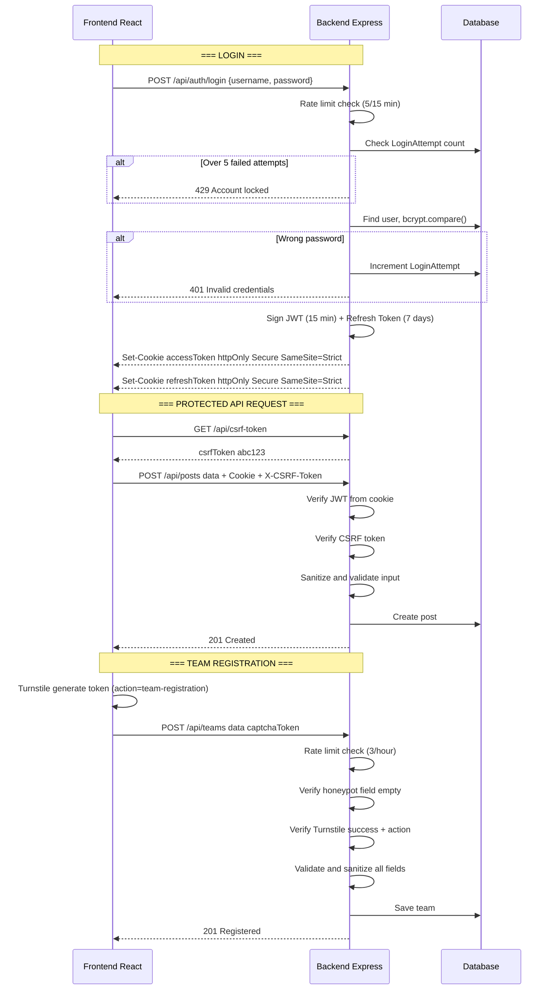
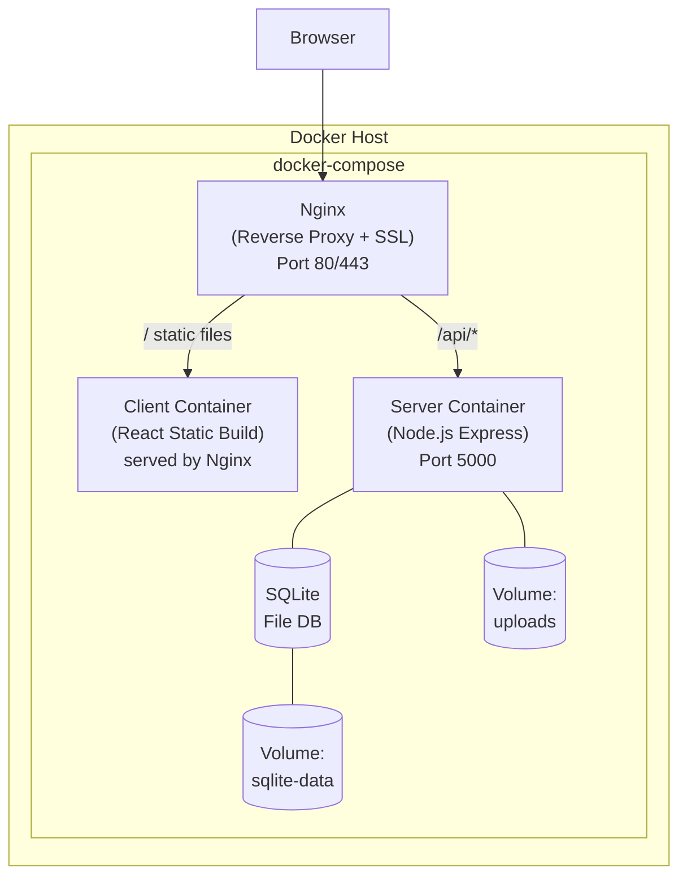

# Information Security Competition 2026 Website — Da Lat University

## Project Overview

Build a website to introduce and manage the Information Security Competition 2026 organized by the Faculty of Information Technology, Da Lat University. The website includes:
- **Frontend**: React (Vite) — modern interface, cybersecurity style
- **Backend**: Node.js (Express) — REST API, manage posts, scoreboard, admin login
- **Database**: SQLite (better-sqlite3) — lightweight, no separate DB server needed, file-based

## Implementation Status — updated 12/08/2026

| Phase | Actual Status |
| --- | --- |
| 1–6 | Completed code, UI, Admin Dashboard, integration and polish |
| 7 | Completed hardening and 133 tests; online `npm outdated` waiting for registry query permission |
| 8 | Completed Docker/local smoke test, HTTPS overlay, production validator and systemd template; no real domain/VPS/certificate yet |
| 9 | Completed README, setup guide, API reference, specification and progress synchronization |
| v2 A–G | Completed theme, splash, public pages, About upgrade and posts search/categories |
| v2 H–I | Automated integration, performance and OWASP validation completed; visual screenshot evidence remains pending |
| v2 J | Code review and documentation polish completed |

Standard operation document is [setup_guide.md](setup_guide.md); standard API contract is [api_reference.md](api_reference.md). The v2 feature design is maintained in [implementation_plan_v2.md](implementation_plan_v2.md), with execution status in [implementation_checklist_v2.md](implementation_checklist_v2.md). The MongoDB, reCAPTCHA snippets or `client/server` paths not located in `src/` in the historical design below are no longer used for deployment.

### Design Style (inspired by Digital Dragons CTF & PTIT CTF)
- Persisted dark/light theme system; dark mode retains background `#0a0e1a`, neon blue `#00f0ff`, purple `#7b2ff7` and neon green `#39ff14`
- Glassmorphism + particle background animation
- Self-hosted variable typography: Inter and JetBrains Mono
- Glitch text effects, terminal-style elements, gradient borders
- Fully responsive (mobile-first)

---

## Page Structure (Pages)

### 1. Home Page (`/`)
- **Hero Section**: Large competition name with glitch/neon effects, countdown timer to competition day (26/9/2026), CTA buttons "Register to Participate" & "View Rules"
- **Competition Introduction**: Brief description of the CTF Jeopardy competition, purpose (according to official plan)
- **Competition Journey** (timeline/steps): Registration → Online Preliminary → In-person Final → Awards
- **11 Competition Topics**: Cards displaying topics (Web Security, Cryptography, Reverse Engineering, Forensic, Network, CCNA, Linux Admin, Windows Admin, Cloud, Programming & Algorithms, Deployment & Incident Response)
- **Prizes**: Display prize structure (1 First, 1 Second, 2 Third, 2 Consolation)
- **Organizer**: Faculty of Information Technology — Da Lat University, university logo
- **Partners / Sponsors** (if any)
- **Footer**: Contact information, quick links, copyright

### 2. Competition Information (`/about`)
- **Purpose, Requirements** (from official plan section I)
- **Target Participants**: Full-time students K46-K49, Faculties of IT, Math-IT, Physics-Nuclear Engineering
- **Detailed Schedule**:
  - Registration period: Until 20/9/2026
  - Briefing meeting: 21/9/2026
  - Round 1 Preliminary (Online): 20:00 26/9 → 20:00 27/9/2026 (24h)
  - Round 2 Final: 7:30–17:00 30/9/2026, IT Center Computer Room
  - Summary & Awards: TBA
- **Organizing Committee**: List of OC members according to table
- **CTF Domains Overview**: 11 official domains linked to the learning roadmap
- **Code of Conduct**: Ethical participation rules from the official competition plan
- **Community Links**: Faculty website, Facebook, contact and registration

### 3. Competition Rules (`/rules`)
> Referenced from Digital Dragons CTF contest page & PTIT CTF, but **suitable for official plan**

- **Participation Conditions**:
  - Full-time students K46–K49, Faculties of IT, Math-IT, Physics-Nuclear Engineering — Da Lat University
  - Each team has 04 members, can be from different classes/cohorts
  - Each student can only join 01 team
  - K46 students who participated previously must register in different teams
- **Registration**: Via the online system provided by the OC
- **Competition Format**:
  - Round 1: Online 24h, CTF Jeopardy on CTFd, 11 topics. Top 06 teams enter final
  - Round 2: In-person at computer room, 7:30–17:00, scoreboard frozen at 16:00
- **Competition Regulations**:
  - Strictly forbidden to attack the competition system or other teams
  - Strictly forbidden to share flags, solutions
  - Comply with ethics and laws
  - Violation → immediate disqualification
- **Scoring & Ranking Method**:
  - Score based on number of challenges solved + completion time
  - Tie-breaker → earlier completion ranks higher
  - Final: scoreboard frozen at 16:00, unlocked after conclusion
- **Prizes**: 1 First (Gold+Flag+Cash), 1 Second (Silver+Flag+Cash), 2 Third (Bronze+Flag+Cash), 2 Consolation (Flag+Cash)
- **Code of Conduct** (reference Digital Dragons)
- **Rights & Obligations** of contestants and OC

### 4. Posts / News (`/posts`)
- List of posts in blog/card grid format
- Each post has: title, cover image, publish date, summary and category badge
- Search by title/summary/content; filter by announcement, news, write-up or guide
- Server-backed pagination with validated `search`, `category`, `page` and `limit` parameters
- Click → detail page (`/posts/:id`)
- **Only Admin has permission to create/edit/delete posts and select categories**

### 5. Scoreboard (`/scoreboard`)
- API-backed scoreboard with animation
- Columns: Rank, Team Name, Score, Solved challenges, Completion time
- Support freeze scoreboard
- Line chart of score progress over time
- **Admin updates scoreboard via dashboard**

### 6. Registration (`/register`)
- Team registration form (or Google Form link)
- Team info: Team Name, Captain, Phone
- Member info (x4): Full Name, Student ID, Class, Faculty, Email, Nickname

### 7. Contact (`/contact`)
- Faculty of Information Technology info: Address, Email, Phone
- Contact form stores validated feedback in SQLite; authenticated admins can retrieve it through `GET /api/contact`
- Social media links (Faculty of IT Facebook, etc.)

### 8. Admin Login Page (`/login`)
- Username/password login form
- JWT authentication
- Only for Organizing Committee

### 9. Admin Dashboard (`/admin`) — Protected
- **Post Management**: CRUD posts (Markdown editor)
- **Scoreboard Management**: Add/edit/delete teams, update scores, freeze/unlock scoreboard
- **Registration Management**: View list of registered teams

### 10. Competition Rounds (`/games`)
- Two official competition rounds with computed Upcoming/Active/Ended status
- Accessible status filters and responsive round cards
- Grid of all 11 challenge domains linked to `/learn`

### 11. CTF Learning Roadmap (`/learn`)
- Fundamentals, expandable modules for 11 official domains and difficulty labels
- Safe tool setup guidance and external practice platforms
- External resources use `target="_blank"` with `rel="noopener noreferrer"`

### 12. Privacy Policy (`/privacy-policy`)
- Ten-section public privacy notice with table-of-contents navigation
- Documents collection, retention, protection and participant data rights

### 13. Terms of Use (`/terms-of-use`)
- Ten-section public terms document aligned with the official competition rules
- Covers eligibility, acceptable conduct, intellectual property and termination

### 14. Branded HTTP Errors (`/errors/:statusCode`, wildcard `404`)
- Branded pages for common HTTP failures with safe retry/back-navigation actions
- Uncaught React render failures are converted to the HTTP 500 experience

### Cross-cutting v2 experience
- Session-only terminal splash with a skip action and reduced-motion support
- Persisted dark/light theme with CSP-safe anti-FOUC initialization
- Route-level lazy loading for v2 pages and a reproducible 50 KiB gzip budget
- Full details and acceptance criteria: [implementation_plan_v2.md](implementation_plan_v2.md)

---

## Technical Architecture

### Frontend (React + Vite)

```
src/client/
├── public/
│   ├── images/           # Logo, banner, icons
│   └── fonts/
├── src/
│   ├── assets/           # Static assets
│   ├── components/
│   │   ├── errors/            # Branded render-error boundary
│   │   ├── games/             # Round filters, cards and topic grid
│   │   ├── learn/             # Topic, tools and practice components
│   │   ├── routing/           # Route scroll restoration
│   │   ├── layout/
│   │   │   ├── Navbar.jsx
│   │   │   ├── Footer.jsx
│   │   │   └── Layout.jsx
│   │   ├── home/
│   │   │   ├── HeroSection.jsx
│   │   │   ├── CountdownTimer.jsx
│   │   │   ├── TopicsGrid.jsx
│   │   │   ├── Timeline.jsx
│   │   │   ├── PrizesSection.jsx
│   │   │   └── SponsorsSection.jsx
│   │   ├── common/
│   │   │   ├── ParticleBackground.jsx
│   │   │   ├── GlitchText.jsx
│   │   │   ├── NeonButton.jsx
│   │   │   ├── GlassCard.jsx
│   │   │   └── Loading.jsx
│   │   ├── scoreboard/
│   │   │   ├── ScoreTable.jsx
│   │   │   └── ScoreChart.jsx
│   │   ├── posts/
│   │   │   ├── PostCard.jsx
│   │   │   └── PostDetail.jsx
│   │   └── admin/
│   │       ├── PostEditor.jsx
│   │       ├── ScoreManager.jsx
│   │       └── TeamManager.jsx
│   ├── pages/
│   │   ├── HomePage.jsx
│   │   ├── AboutPage.jsx
│   │   ├── RulesPage.jsx
│   │   ├── PostsPage.jsx
│   │   ├── PostDetailPage.jsx
│   │   ├── ScoreboardPage.jsx
│   │   ├── RegisterPage.jsx
│   │   ├── ContactPage.jsx
│   │   ├── LoginPage.jsx
│   │   ├── AdminDashboard.jsx
│   │   ├── GamesPage.jsx
│   │   ├── LearnPage.jsx
│   │   ├── PrivacyPolicyPage.jsx
│   │   ├── TermsOfUsePage.jsx
│   │   └── HttpErrorPage.jsx
│   ├── context/
│   │   ├── AuthContext.jsx
│   │   └── ThemeContext.jsx
│   ├── hooks/
│   │   └── useAuth.js
│   ├── services/
│   │   └── api.js
│   ├── styles/
│   │   ├── index.css        # Design system, variables, global styles
│   │   ├── animations.css
│   │   └── components/      # Per-component CSS modules
│   ├── App.jsx
│   └── main.jsx
├── package.json
└── vite.config.js
```

### Backend (Node.js + Express)

```
src/server/
├── src/
│   ├── config/              # Auth, runtime, SQLite schema and security
│   ├── controllers/         # Auth, post, score and team HTTP logic
│   ├── middleware/          # Auth, CAPTCHA, CSRF, rate limit, upload and safe logging
│   ├── models/              # User, token, post, team, score and contact persistence
│   ├── routes/              # API router composition
│   ├── seeds/               # Idempotent admin seed
│   ├── utils/               # JWT and validation helpers
│   ├── app.js               # Express application factory
│   └── server.js            # Process entry point
├── data/                    # SQLite runtime data (ignored)
├── uploads/                 # Uploaded images (ignored)
├── test/                    # Node.js tests
├── Dockerfile
└── package.json
```

### API Endpoints

| Method | Endpoint | Auth | Description |
|--------|----------|------|--------|
| POST | `/api/auth/login` | ❌ | Admin login |
| POST | `/api/auth/logout` | ✅ | Logout, clear cookie + blacklist refresh token |
| POST | `/api/auth/refresh` | ❌ | Refresh access token using refresh token cookie |
| GET | `/api/auth/me` | ✅ | Get current user info |
| GET | `/api/auth/session` | ❌ | Anonymous-safe session discovery |
| GET | `/api/csrf-token` | ❌ | Get CSRF token for mutation requests |
| GET | `/api/posts` | ❌ | Search/filter/paginate posts with `search`, `category`, `page`, `limit` |
| GET | `/api/posts/:id` | ❌ | Post details |
| POST | `/api/posts` | ✅ | Create new post |
| PUT | `/api/posts/:id` | ✅ | Update post |
| DELETE | `/api/posts/:id` | ✅ | Delete post |
| GET | `/api/teams` | ❌ | List of teams (public, limited) |
| POST | `/api/teams` | ❌ | Register new team (+ CAPTCHA) |
| GET | `/api/teams/all` | ✅ | All teams (admin) |
| DELETE | `/api/teams/:id` | ✅ | Delete team |
| GET | `/api/scores` | ❌ | Scoreboard |
| POST | `/api/scores` | ✅ | Add score |
| PUT | `/api/scores/:id` | ✅ | Update score |
| DELETE | `/api/scores/:id` | ✅ | Delete score |
| PUT | `/api/scores/freeze` | ✅ | Freeze/unlock scoreboard |
| GET | `/api/contact` | ✅ | List stored contact requests |
| POST | `/api/contact` | ❌ | Store a validated contact request (+ CAPTCHA) |
| POST | `/api/uploads` | ✅ | Upload a validated cover image |

### Dependencies

**Frontend:**
- `react`, `react-dom`, `react-router-dom`
- `axios` — HTTP client
- `react-markdown`, `rehype-sanitize` — Render post markdown (with sanitize)
- `recharts` — Scoreboard charts
- `@tsparticles/react`, `@tsparticles/slim` — Particle background
- `@fontsource-variable/inter`, `@fontsource-variable/jetbrains-mono` — Self-hosted fonts
- Cloudflare Turnstile client script — CAPTCHA widget, no npm package needed

**Backend:**
- `express`, `cors`, `dotenv`
- `better-sqlite3` — SQLite driver (file-based, no DB server needed)
- `jsonwebtoken`, `bcryptjs` — Auth
- `multer` — File upload
- `express-validator` — Validation
- `helmet` — HTTP security headers (CSP, HSTS, X-Frame-Options, etc.)
- `express-rate-limit` — Rate limiting per IP
- `cookie-parser` — Parse httpOnly cookies for JWT
- Custom HMAC CSRF middleware — CSRF protection without an extra package
- `express-slow-down` — Slow down responses for brute-force

---

## 🔐 Security Architecture

Since this is a website for an **Information Security** competition, security must be the top priority. Below is the comprehensive security architecture:

### 1. Authentication & Session Management

| Issue | Solution |
|--------|----------|
| JWT Storage | **HttpOnly + Secure + SameSite=Strict cookie** — DO NOT store in localStorage/sessionStorage (prevent XSS token theft) |
| Access Token Lifespan | **15 minutes** — minimize risk if token is leaked |
| Refresh Token | **7 days**, stored in separate httpOnly cookie, rotate after each refresh |
| Logout | Clear cookie + blacklist refresh token (store in DB) |
| Password hashing | **bcrypt** with salt rounds = 12 (do not use MD5/SHA) |
| Brute-force login | Lock account after **5 failed logins** in 15 minutes (`LoginAttempt` model) |
| Admin password | Enforce minimum 12 characters, uppercase + lowercase + number + special character |

```javascript
// Example: Set JWT to httpOnly cookie
res.cookie('accessToken', token, {
  httpOnly: true,       // JavaScript CANNOT read
  secure: true,         // Send via HTTPS only
  sameSite: 'Strict',   // CSRF protection
  maxAge: 15 * 60 * 1000, // 15 minutes
  path: '/api'
});
```

### 2. API Security

#### Rate Limiting
```javascript
// config/security.js
module.exports = {
  rateLimits: {
    global:    { windowMs: 15 * 60 * 1000, max: 100 },  // 100 req/15 minutes
    auth:      { windowMs: 15 * 60 * 1000, max: 5 },    // 5 logins/15 minutes
    register:  { windowMs: 60 * 60 * 1000, max: 3 },    // 3 registrations/hour
    contact:   { windowMs: 60 * 60 * 1000, max: 5 },    // 5 messages/hour
    upload:    { windowMs: 60 * 60 * 1000, max: 10 },   // 10 uploads/hour
    api:       { windowMs: 1 * 60 * 1000,  max: 30 },   // 30 req/minute for API
  }
};
```

#### CORS Whitelist
```javascript
const corsOptions = {
  origin: [process.env.CLIENT_URL],  // Allow frontend domain only
  credentials: true,                  // Allow sending cookies
  methods: ['GET', 'POST', 'PUT', 'DELETE'],
  allowedHeaders: ['Content-Type', 'X-CSRF-Token'],
};
```

### 3. Anti-Bot & Spam

| Page/Form | Measure |
|------------|----------|
| Team registration (`/register`) | **Cloudflare Turnstile** (`action=team-registration`) + rate limit 3/hour |
| Contact (`/contact`) | **Cloudflare Turnstile** (`action=contact`) + rate limit 5/hour |
| Login (`/login`) | Rate limit 5/15 minutes + account lockout |
| Public API (GET) | Rate limit 30 req/minute per IP |
| Honeypot field | Add hidden field in form — automated bots fill it → reject |

```javascript
// middleware/captcha.js
const verifyCaptcha = async (req, res, next) => {
  const { captchaToken } = req.body;
  if (!captchaToken) return res.status(400).json({ error: 'CAPTCHA required' });
  
  const response = await fetch('https://challenges.cloudflare.com/turnstile/v0/siteverify', {
    method: 'POST',
    headers: { 'Content-Type': 'application/json' },
    body: JSON.stringify({
      secret: process.env.TURNSTILE_SECRET_KEY,
      response: captchaToken,
      remoteip: req.ip,
    }),
  });
  const data = await response.json();
  
  if (!data.success || data.action !== 'team-registration') {
    return res.status(403).json({ error: 'CAPTCHA verification failed' });
  }
  next();
};
```

### 4. Anti-XSS (Cross-Site Scripting)

- **Input validation**: `express-validator` schemas plus unsafe-key rejection; do not rewrite passwords or Markdown globally
- **Output encoding**: React automatically escapes HTML output (safe by default)
- **Markdown rendering**: Use `react-markdown` with `rehype-sanitize` — block `<script>`, `<iframe>`, `onerror`
- **CSP Header** (Content Security Policy) via `helmet`:

```javascript
helmet.contentSecurityPolicy({
  directives: {
    defaultSrc: ["'self'"],
    scriptSrc: ["'self'", "https://challenges.cloudflare.com"],
    styleSrc: ["'self'", "'unsafe-inline'", "https://fonts.googleapis.com"],
    fontSrc: ["'self'", "https://fonts.gstatic.com"],
    imgSrc: ["'self'", "data:", "blob:"],
    connectSrc: ["'self'"],
    frameSrc: ["https://challenges.cloudflare.com"],
  },
});
```

### 5. Anti-CSRF (Cross-Site Request Forgery)

- JWT token in **httpOnly cookie + SameSite=Strict** → blocks most CSRF
- Add **CSRF token** for mutations (POST/PUT/DELETE):
  - Backend creates CSRF token → sends via `GET /api/csrf-token` endpoint
  - Frontend attaches token to `X-CSRF-Token` header for every mutation request
  - Backend verifies CSRF token before processing

### 6. Anti-SQL Injection

Use **Prepared Statements (Parameterized Queries)** — NEVER concatenate SQL strings:

```javascript
// ❌ DANGEROUS — SQL Injection
const user = db.prepare(`SELECT * FROM users WHERE username = '${username}'`).get();

// ✅ SAFE — Prepared Statement (better-sqlite3)
const user = db.prepare('SELECT * FROM users WHERE username = ?').get(username);

// ✅ SAFE — Named parameters
const post = db.prepare('INSERT INTO posts (title, content, author_id) VALUES (@title, @content, @authorId)').run({
  title: sanitizedTitle,
  content: sanitizedContent,
  authorId: req.user.id
});
```

- `better-sqlite3` supports native prepared statements — this is the primary defense against SQL Injection
- All queries in `models/` MUST use `?` placeholder or `@named` parameters
- Combine with input validation (`express-validator`) to reject abnormal data before querying

### 7. Input Validation & Sanitization

```javascript
// utils/validators.js — Example validation for team registration
const { body } = require('express-validator');

const teamRegistrationRules = [
  body('teamName')
    .trim().isLength({ min: 2, max: 50 }).escape()
    .withMessage('Team name from 2-50 characters'),
  body('captainPhone')
    .matches(/^(0[3-9])\d{8}$/).withMessage('Invalid phone number'),
  body('members')
    .isArray({ min: 4, max: 4 }).withMessage('Team must have exactly 4 members'),
  body('members.*.studentId')
    .matches(/^\d{7,10}$/).withMessage('Invalid Student ID'),
  body('members.*.email')
    .isEmail().normalizeEmail().withMessage('Invalid email'),
  body('members.*.fullName')
    .trim().isLength({ min: 2, max: 100 }).escape(),
  // Honeypot: hidden field must be empty
  body('website').isEmpty().withMessage('Bot detected'),
];
```

### 8. File Upload Security

```javascript
// middleware/upload.js
const multer = require('multer');
const path = require('path');
const crypto = require('crypto');

const ALLOWED_MIMES = ['image/jpeg', 'image/png', 'image/webp', 'image/gif'];
const MAX_SIZE = 2 * 1024 * 1024; // 2MB

const storage = multer.diskStorage({
  destination: './uploads/',
  filename: (req, file, cb) => {
    // Random filename → prevent path traversal & enumeration
    const uniqueName = crypto.randomBytes(16).toString('hex') + path.extname(file.originalname);
    cb(null, uniqueName);
  }
});

const upload = multer({
  storage,
  limits: { fileSize: MAX_SIZE },
  fileFilter: (req, file, cb) => {
    if (!ALLOWED_MIMES.includes(file.mimetype)) {
      return cb(new Error('Only accept image files (JPEG, PNG, WebP, GIF)'));
    }
    cb(null, true);
  }
});
```

### 9. HTTP Security Headers (Helmet)

```javascript
const helmet = require('helmet');
app.use(helmet());  // Includes:
// ✅ X-Content-Type-Options: nosniff
// ✅ X-Frame-Options: DENY
// ✅ X-XSS-Protection: 0 (use CSP instead)
// ✅ Strict-Transport-Security (HSTS)
// ✅ Referrer-Policy: no-referrer
// ✅ Content-Security-Policy (custom above)
```

### 10. Safe Error Handling

```javascript
// middleware/errorHandler.js
const errorHandler = (err, req, res, next) => {
  console.error(`[${new Date().toISOString()}] ${req.method} ${req.path}`, {
    name: err.name,
    statusCode: err.status || 500,
    type: err.type
  }); // Never log request bodies, credentials, or PII
  
  // DO NOT return stack trace to client
  res.status(err.status || 500).json({
    error: process.env.NODE_ENV === 'production'
      ? 'Internal server error'        // Production: generic message
      : err.message                      // Development: more detailed
  });
};
```

### 11. Environment Variables & Secrets

```env
# .env (DO NOT commit to Git)
NODE_ENV=production
SQLITE_PATH=./data/dlu-ctf.sqlite
JWT_SECRET=<random-64-chars>          # openssl rand -hex 32
JWT_REFRESH_SECRET=<random-64-chars>   # Different from JWT_SECRET
VITE_TURNSTILE_SITE_KEY=<cloudflare-turnstile-site-key>
TURNSTILE_SECRET_KEY=<cloudflare-turnstile-secret-key>
CSRF_SECRET=<random-32-chars>
CLIENT_URL=https://your-domain.com
COOKIE_DOMAIN=your-domain.com
```

```gitignore
# .gitignore
.env
node_modules/
uploads/
```

### 12. Security Flow Diagram



### Summary: Security Checklist

| # | Category | Measure | Status |
|---|----------|-----------|------------|
| 1 | JWT Storage | httpOnly + Secure + SameSite cookie | ✅ |
| 2 | Password | bcrypt salt=12, enforce complexity | ✅ |
| 3 | Brute-force | Account lockout 5 fails/15 min | ✅ |
| 4 | Rate Limiting | Per-route limits (login, register, API) | ✅ |
| 5 | CAPTCHA | Cloudflare Turnstile (register, contact) | ✅ |
| 6 | CSRF | SameSite cookie + CSRF token header | ✅ |
| 7 | XSS | Input sanitize + CSP + React escape | ✅ |
| 8 | SQL Injection | Prepared statements (parameterized queries) | ✅ |
| 9 | HTTP Headers | Helmet (HSTS, X-Frame, CSP, etc.) | ✅ |
| 10 | File Upload | MIME whitelist, 2MB limit, random name | ✅ |
| 11 | Error Handling | No stack trace in production | ✅ |
| 12 | Secrets | .env, .gitignore, no hardcoded secrets | ✅ |
| 13 | CORS | Whitelist client origin only | ✅ |
| 14 | Honeypot | Hidden field in public forms | ✅ |
| 15 | Token Refresh | Rotate refresh token on each use | ✅ |
| 16 | Param Pollution | Query parser + unsafe-key guard | ✅ |
| 17 | Markdown Render | rehype-sanitize (no script/iframe) | ✅ |

### OWASP Top 10 (2021) — Specific Mapping & Test

The IT security competition website must meet the OWASP Top 10 standards. Below is the detailed mapping:

| # | OWASP | Risk | Project Measure | Specific Test |
|---|-------|--------|----------------------|-------------|
| A01 | **Broken Access Control** | Unauthorized access to admin resources | JWT httpOnly cookie + ProtectedRoute + auth.js middleware role check | ① `GET /api/teams/all` no cookie → 401. ② `DELETE /api/posts/1` no cookie → 401. ③ Access `/admin` without login → redirect `/login`. ④ Modify JWT payload (change role) → 401 (signature invalid) |
| A02 | **Cryptographic Failures** | Expose sensitive data, weak passwords | bcrypt salt=12, JWT secret 64 chars, HTTPS only, Secure cookie, do not log password | ① Check DB: password is bcrypt hash (starts with `$2b$`), no plaintext. ② Disable HTTPS → cookie not sent (Secure flag). ③ API response does not contain password/hash. ④ `.env` is in `.gitignore` |
| A03 | **Injection** | SQL Injection, XSS | Prepared statements (better-sqlite3 `?`/`@param`), express-validator, CSP, rehype-sanitize | ① Send `' OR 1=1 --` in login → login failed. ② Send `'; DROP TABLE users; --` in form → no effect on DB. ③ Send `<script>alert(1)</script>` in post → render as text, no execution. ④ Send `` → removed by rehype-sanitize |
| A04 | **Insecure Design** | Insecure design from the start | Security-by-design: 17 items checklist, threat modeling, defense in depth | ① Code review: all admin routes have `auth` middleware. ② All public forms have CAPTCHA + honeypot. ③ Rate limit on all sensitive endpoints |
| A05 | **Security Misconfiguration** | Server misconfiguration, missing headers | Helmet (CSP, HSTS, X-Frame-Options), CORS whitelist, error handler hides stack | ① Check response headers for: `Content-Security-Policy`, `Strict-Transport-Security`, `X-Frame-Options: DENY`, `X-Content-Type-Options: nosniff`. ② Trigger 500 error → response only has `"Internal server error"`, no stack trace. ③ Request from unknown domain → blocked by CORS |
| A06 | **Vulnerable Components** | Dependencies with known vulnerabilities | `npm audit` periodically, lockfile, Alpine Docker image | ① Run `npm audit` → 0 critical/high. ② Run `npm outdated` → no major outdated package. ③ Docker image uses Alpine (minimal surface) |
| A07 | **Auth Failures** | Brute-force, session hijack, credential stuffing | Account lockout 5 fails/15min, token rotation, httpOnly cookie, bcrypt | ① Wrong login 5 times → account lock `423`; independent HTTP limiter returns `429` on quota exceed. ② Use old refresh token after rotation → rejected. ③ Production cookie has SameSite=Strict. ④ Logout → cookie cleared, refresh token revoked |
| A08 | **Software & Data Integrity** | Data tampering, supply chain attack | JWT signature verification, CSRF token, lockfile integrity | ① Modify JWT token body (base64) → server reject (invalid signature). ② Send POST without X-CSRF-Token → 403. ③ `package-lock.json` in Git (integrity check) |
| A09 | **Logging & Monitoring** | Inability to detect attacks | Sanitized error metadata, LoginAttempt model logs brute-force, Docker logs | ① Wrong login → check LoginAttempt table for new record. ② Server error → check logs for timestamp, route and status without request body/credentials. ③ `docker-compose logs server` shows access logs |
| A10 | **SSRF** | Server exploited to call internal services | No feature to fetch URL from user input, upload only accepts direct files | ① No endpoint accepts URL from user to fetch. ② Upload only accepts multipart file, not URL |

---

## Questions for Confirmation

1. **Team Registration**: Form integrated directly on the website or external Google Form link?
2. **Markdown Editor for admin**: Textarea + preview or WYSIWYG editor (rich text)?
3. **Logo & banner images**: Already available or need to be created?
4. **Prize amounts**: Display specific amount on website or just state "Cash"?
5. **Hosting/Deploy**: VPS, Vercel + Railway, Render, or other options?

---

## Testing Plan

### Functional Testing
- Check all pages render correctly on browser
- Test responsive on mobile/tablet
- Test admin login → create post → display on posts page
- Test update scoreboard → refetch API → display the latest data
- Test team registration → save database → display in admin
- Check all navigation links work
- Test dark mode visual consistency

### Security Testing
- **Auth**: Try to access `/admin` when not logged in → redirect to `/login`
- **Auth**: Try to send request to protected API without cookie → 401
- **Auth**: Verify JWT does not appear in localStorage/sessionStorage
- **Auth**: Verify cookie has httpOnly, Secure, SameSite flags
- **Brute-force**: Wrong login 5 times → verify account is locked for 15 minutes
- **Rate limit**: Send >100 fast requests → verify receiving 429 Too Many Requests
- **CAPTCHA**: Try to submit registration form without captchaToken → verify rejection
- **XSS**: Input `<script>alert('xss')</script>` in forms → verify it is sanitized
- **SQL Injection**: Send `' OR 1=1 --` in login form → verify login failure
- **SQL Injection**: Send `'; DROP TABLE users; --` in input → verify DB is not affected
- **CSRF**: Send mutation request from another domain → verify rejection
- **File upload**: Try to upload .exe, .php file → verify rejection
- **File upload**: Try to upload file >2MB → verify rejection
- **Headers**: Check response headers have Helmet headers
- **Error**: Trigger server error → verify response does not contain stack trace
- **Secrets**: Verify `.env` is in `.gitignore`

---

## 🐳 Docker Deployment

> **Deployment update on 11/08/2026:** The project has migrated to SQLite and npm workspaces in `src/`. Current configuration is in `docker-compose.yml`, development/production overrides, `src/client/Dockerfile`, `src/server/Dockerfile`, `nginx/` and `deploy/`. See [Phase 8 Specification](phase_8_spec.md) along with [setup guide](setup_guide.md). The MongoDB snippets and `client/server` paths below are initial designs, kept for historical purposes only and **are not used for deployment**.

### Initial Docker Architecture (replaced)



### Docker File Structure

```
project-root/
├── docker-compose.yml          # Orchestrate all services
├── docker-compose.dev.yml      # Override for development
├── .dockerignore               # Ignore node_modules, .env, etc.
├── client/
│   └── Dockerfile              # Multi-stage build (build → nginx serve)
├── server/
│   └── Dockerfile              # Node.js production image
└── nginx/
    ├── nginx.conf              # Reverse proxy config
    └── ssl/                    # SSL certificates (production)
```

### Dockerfile — Frontend (client/Dockerfile)

```dockerfile
# Stage 1: Build React app
FROM node:20-alpine AS build
WORKDIR /app
COPY package*.json ./
RUN npm ci --only=production
COPY . .
RUN npm run build

# Stage 2: Serve with Nginx
FROM nginx:alpine
COPY --from=build /app/dist /usr/share/nginx/html
COPY nginx.conf /etc/nginx/conf.d/default.conf
EXPOSE 80
CMD ["nginx", "-g", "daemon off;"]
```

### Dockerfile — Backend (server/Dockerfile)

```dockerfile
FROM node:20-alpine

# Create non-root user for security
RUN addgroup -S appgroup && adduser -S appuser -G appgroup

WORKDIR /app
COPY package*.json ./
RUN npm ci --only=production

COPY . .

# Create uploads directory
RUN mkdir -p uploads && chown -R appuser:appgroup uploads

# Run as non-root user
USER appuser
EXPOSE 5000
CMD ["node", "server.js"]
```

### docker-compose.yml

```yaml
version: '3.8'

services:
  # Backend API
  # SQLite doesn't need separate DB container — file DB is in sqlite-data volume
  server:
    build: ./server
    container_name: dlu-ctf-server
    restart: unless-stopped
    volumes:
      - uploads:/app/uploads
      - sqlite-data:/app/data
    networks:
      - app
    environment:
      NODE_ENV: production
      SQLITE_PATH: ./data/dlu-ctf.sqlite
      JWT_SECRET: ${JWT_SECRET}
      JWT_REFRESH_SECRET: ${JWT_REFRESH_SECRET}
      TURNSTILE_SECRET_KEY: ${TURNSTILE_SECRET_KEY}
      CSRF_SECRET: ${CSRF_SECRET}
      CLIENT_URL: ${CLIENT_URL}
      COOKIE_DOMAIN: ${COOKIE_DOMAIN}
    expose:
      - "5000"

  # Frontend
  client:
    build: ./client
    container_name: dlu-ctf-client
    restart: unless-stopped
    depends_on:
      - server
    networks:
      - app
    expose:
      - "80"

  # Nginx Reverse Proxy
  nginx:
    image: nginx:alpine
    container_name: dlu-ctf-nginx
    restart: unless-stopped
    depends_on:
      - client
      - server
    ports:
      - "80:80"
      - "443:443"
    volumes:
      - ./nginx/nginx.conf:/etc/nginx/nginx.conf:ro
      - ./nginx/ssl:/etc/nginx/ssl:ro
    networks:
      - app

volumes:
  sqlite-data:
    driver: local
  uploads:
    driver: local

networks:
  app:
    driver: bridge
```

### docker-compose.dev.yml (Development override)

```yaml
version: '3.8'

services:
  server:
    build:
      context: ./server
      dockerfile: Dockerfile
    volumes:
      - ./server:/app
      - /app/node_modules
    environment:
      NODE_ENV: development
    command: npx nodemon server.js

  client:
    build:
      context: ./client
      dockerfile: Dockerfile
    volumes:
      - ./client/src:/app/src
    command: npm run dev -- --host 0.0.0.0
    ports:
      - "5173:5173"

  nginx:
    ports:
      - "80:80"
```

### Nginx config (nginx/nginx.conf)

```nginx
events {
    worker_connections 1024;
}

http {
    # Rate limiting zone
    limit_req_zone $binary_remote_addr zone=api:10m rate=30r/m;
    limit_req_zone $binary_remote_addr zone=login:10m rate=5r/m;

    # Gzip compression
    gzip on;
    gzip_types text/plain text/css application/json application/javascript text/xml;

    upstream backend {
        server server:5000;
    }

    upstream frontend {
        server client:80;
    }

    server {
        listen 80;
        server_name your-domain.com;

        # Redirect HTTP → HTTPS (uncomment when SSL is available)
        # return 301 https://$host$request_uri;

        # Security headers
        add_header X-Frame-Options "DENY" always;
        add_header X-Content-Type-Options "nosniff" always;
        add_header X-XSS-Protection "0" always;
        add_header Referrer-Policy "no-referrer" always;

        # API proxy
        location /api/ {
            limit_req zone=api burst=10 nodelay;
            proxy_pass http://backend;
            proxy_set_header Host $host;
            proxy_set_header X-Real-IP $remote_addr;
            proxy_set_header X-Forwarded-For $proxy_add_x_forwarded_for;
            proxy_set_header X-Forwarded-Proto $scheme;

            # Limit body size (file upload)
            client_max_body_size 2M;
        }

        # Login rate limit separately
        location /api/auth/login {
            limit_req zone=login burst=3 nodelay;
            proxy_pass http://backend;
            proxy_set_header Host $host;
            proxy_set_header X-Real-IP $remote_addr;
            proxy_set_header X-Forwarded-For $proxy_add_x_forwarded_for;
        }

        # Uploaded files
        location /uploads/ {
            proxy_pass http://backend;
            expires 30d;
            add_header Cache-Control "public, immutable";
        }

        # Frontend SPA
        location / {
            proxy_pass http://frontend;
            try_files $uri $uri/ /index.html;
        }
    }

    # HTTPS server (uncomment when SSL is available)
    # server {
    #     listen 443 ssl http2;
    #     server_name your-domain.com;
    #     ssl_certificate /etc/nginx/ssl/fullchain.pem;
    #     ssl_certificate_key /etc/nginx/ssl/privkey.pem;
    #     ssl_protocols TLSv1.2 TLSv1.3;
    #     ssl_ciphers HIGH:!aNULL:!MD5;
    #     add_header Strict-Transport-Security "max-age=31536000; includeSubDomains" always;
    #     # ... (copy the location blocks above)
    # }
}
```

### .dockerignore

```
node_modules
.env
.git
*.md
uploads/*
!uploads/.gitkeep
```

### Deployment Commands

```bash
# === Development ===
docker compose -f docker-compose.yml -f docker-compose.dev.yml up --build

# === Production ===
# 1. Configure .env
cp .env.example .env
# Edit values in .env

# 2. Build & run
docker compose up -d --build --wait

# 3. Seed admin account
docker compose exec server npm run seed --workspace @attt2026/server

# 4. Check logs
docker compose logs -f server

# 5. Stop all
docker compose down

# 6. Stop + delete data (WARNING: data loss!)
docker compose down -v
```

### Docker Security

| Category | Measure |
|----------|----------|
| Base image | Use `alpine` variants (minimal attack surface) |
| Non-root user | Backend container runs with `appuser`, not root |
| Secrets | Passed via `.env`, NEVER hardcoded in Dockerfile |
| Network isolation | Common `app` network for all services (SQLite file-based, no separate network for DB needed) |
| Volume | Persistent volume for SQLite data and uploads, not lost on restart |
| No DB container | SQLite file-based — no separate DB container needed, reduces attack surface |
| Restart policy | `unless-stopped` — auto restart on crash |
| Body size | Nginx limits `client_max_body_size 2M` |

---

## Deployment Options

| Option | Pros | Cons | Suitable for |
|-----------|---------|------------|---------|
| **Docker (VPS)** | Full control, 1-command Docker compose, easy backup | Need to manage VPS, manual SSL | ✅ Recommended |
| **Vercel + Railway** | Free tier, auto CI/CD, managed DB | Free tier limits, complex to separate FE/BE | Side projects |
| **Render** | Deploy from Git, free tier, managed PostgreSQL | Cold start, free limits | Demo/staging |
| **Manual VPS** | Cheap, full control | Have to install everything, heavy maintenance | Sysadmin experience |

---

## Questions for Confirmation

1. **Team Registration**: Form integrated directly on the website or external Google Form link?
2. **Markdown Editor for admin**: Textarea + preview or WYSIWYG editor (rich text)?
3. **Logo & banner images**: Already available or need to be created?
4. **Prize amounts**: Display specific amount on website or just state "Cash"?
5. **Hosting/Deploy**: Docker on VPS, Vercel + Railway, Render, or other options?

---

## Testing Plan

### Functional Testing
- Check all pages render correctly on browser
- Test responsive on mobile/tablet
- Test admin login → create post → display on posts page
- Test update scoreboard → refetch API → display the latest data
- Test team registration → save database → display in admin
- Check all navigation links work
- Test dark mode visual consistency

### Security Testing
- **Auth**: Try to access `/admin` when not logged in → redirect to `/login`
- **Auth**: Try to send request to protected API without cookie → 401
- **Auth**: Verify JWT does not appear in localStorage/sessionStorage
- **Auth**: Verify cookie has httpOnly, Secure, SameSite flags
- **Brute-force**: Wrong login 5 times → verify account is locked for 15 minutes
- **Rate limit**: Send >100 fast requests → verify receiving 429 Too Many Requests
- **CAPTCHA**: Try to submit registration form without captchaToken → verify rejection
- **XSS**: Input `<script>alert('xss')</script>` in forms → verify it is sanitized
- **SQL Injection**: Send `' OR 1=1 --` in login form → verify login failure
- **SQL Injection**: Send `'; DROP TABLE users; --` in input → verify DB is not affected
- **CSRF**: Send mutation request from another domain → verify rejection
- **File upload**: Try to upload .exe, .php file → verify rejection
- **File upload**: Try to upload file >2MB → verify rejection
- **Headers**: Check response headers have Helmet headers
- **Error**: Trigger server error → verify response does not contain stack trace
- **Secrets**: Verify `.env` is in `.gitignore`

### Docker Testing
- `docker compose up -d --build --wait` runs successfully without errors
- All containers are healthy (`docker compose ps`)
- Nginx proxy is correct: `/` → frontend, `/api/*` → backend
- SQLite persistent: restart server container → data still exists
- Upload persistent: restart → files still exist
- Rate limiting works via Nginx
- Non-root user in server container (`docker compose exec server id -u` differs from `0`)
